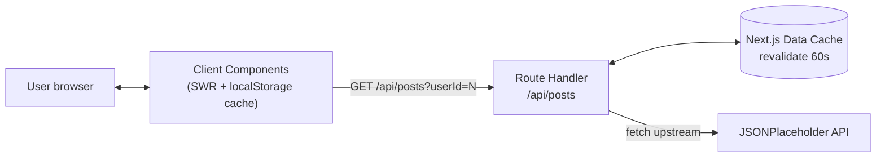
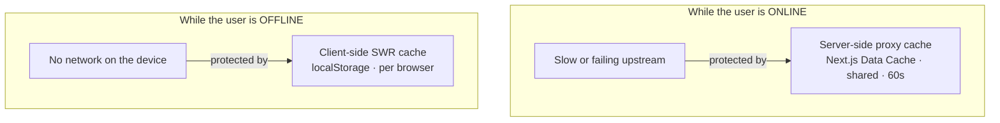
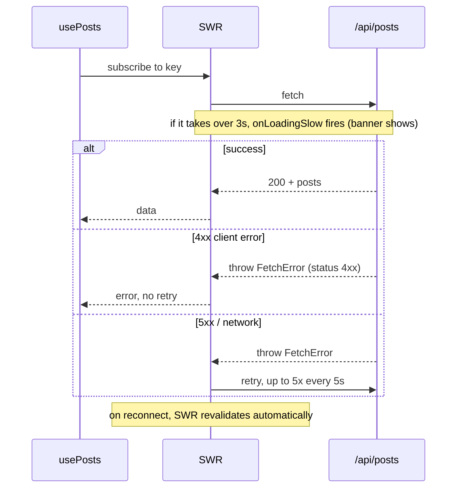
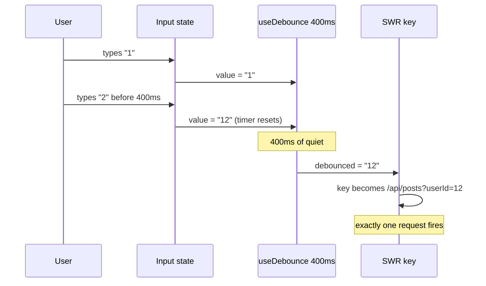

# Solution — Posts (Next.js + SWR)

A `/posts` page that lists posts from
[JSONPlaceholder](https://jsonplaceholder.typicode.com/posts) and filters them by
`userId`. **Live demo:** https://cortabarria-nextjs-posts-app.vercel.app

> **Guiding principle.** The brief targets users on poor, unstable connections.
> So the central question behind every decision was: *what happens when the
> network is slow, drops, or the data source is down?* The features below are
> not separate add-ons — they are different answers to that one question.

This document explains the **what / how / why** of each decision so the code is a
quick confirmation, not a reverse-engineering exercise. Every claim links to the
file that proves it.

---

## 1. Architecture at a glance



The browser never talks to JSONPlaceholder directly. It talks to our own
same-origin Route Handler, which proxies and caches the upstream. That one extra
hop is where most of the resilience lives.

**Stack:** Next.js 16 (App Router) · React 19 · TypeScript (strict) · Tailwind
CSS v4 · SWR 2 · Vitest. See [`package.json`](./package.json).

---

## 2. The two-cache model (read this first)

The single most important idea in this codebase: **there are two independent
caches, protecting against two different failures.**



| | Server-side proxy cache | Client-side SWR cache |
|---|---|---|
| **Where** | Next.js Data Cache (server) | `localStorage` (browser) |
| **Scope** | Shared by all users | One user's browser |
| **Protects against** | A **slow or down upstream** while the user is online | The **user themselves being offline** / reloading |
| **Code** | [`app/api/posts/route.ts`](./app/api/posts/route.ts) | [`lib/local-storage-cache.ts`](./lib/local-storage-cache.ts) |

Keeping these separate is deliberate: each targets a distinct real-world failure
a traveller on bad Wi-Fi actually hits.

---

## 3. Decisions — what, how, why

### 3.1 App Router + the server/client boundary

- **What:** App Router (`app/`), with the page as a Server Component and the
  interactive view as a Client Component.
- **How:** [`app/posts/page.tsx`](./app/posts/page.tsx) is a Server Component
  that renders nothing but `<PostsView />`.
  [`app/posts/posts-view.tsx`](./app/posts/posts-view.tsx) carries `"use client"`
  because it uses SWR hooks (state/effects that only run in the browser).
- **Why:** SWR is a client-side cache; its hooks and the `SWRConfig` provider
  (which passes non-serializable functions) cannot live on the server. Keeping
  the route entry a Server Component pushes the client boundary as deep as
  possible — the default, cheaper rendering path stays in effect for everything
  above it. *Rejected:* making the whole page a Client Component (works, but
  needlessly opts the route out of server rendering).

### 3.2 Backend = a Route Handler that proxies + caches

- **What:** A TypeScript backend endpoint at `/api/posts` that proxies
  JSONPlaceholder and caches it server-side.
- **How:** [`app/api/posts/route.ts`](./app/api/posts/route.ts) reads `userId`
  from the query string, forwards it upstream only when it is a positive integer
  (`/^\d+$/`), and fetches with `next: { revalidate: 60 }`. A non-OK upstream
  becomes a `502`.
- **Why three birds, one stone:**
  1. Satisfies the brief's *"backend in TypeScript"* requirement.
  2. Gives a **single control point** — same-origin (no CORS), one place to add
     caching, validation, and error shaping.
  3. Adds the **server-side cache**: the upstream response is stored in Next.js's
     Data Cache, keyed by URL, for 60s. If a background revalidation fails,
     Next.js keeps serving the last good copy — so a slow or briefly-down
     JSONPlaceholder doesn't reach the user.
- *Rejected:* calling JSONPlaceholder straight from the browser. Simpler, but no
  shared cache, no upstream-failure protection, and CORS-dependent.

### 3.3 SWR as the single data layer

All data access goes through SWR — no `fetch` + `useEffect` by hand. One global
config in [`app/providers.tsx`](./app/providers.tsx) makes every request
resilient by default. The options, and what each one buys:

| Option | Why it's there |
|---|---|
| `revalidateOnReconnect` | Re-runs requests automatically when connectivity returns (Step 3). |
| `shouldRetryOnError` + `onErrorRetry` | Retries transient/network failures, **bounded** (5× / 5s) and **skips 4xx** — client errors won't fix themselves. |
| `loadingTimeout: 3000` + `onLoadingSlow` | Fires the slow-connection notice after 3s (Step 5). |
| `keepPreviousData` | When the filter changes, the old list stays on screen instead of flashing to empty. |
| `provider` | The `localStorage` cache (the client-side half of §2). |

**The linchpin — the fetcher throws on non-OK responses.**
[`lib/fetcher.ts`](./lib/fetcher.ts) throws a `FetchError` (carrying the HTTP
`status`) whenever `!res.ok`. This is load-bearing: SWR treats a *resolved*
promise as success, so a fetcher that swallowed errors would **silently disable**
retry, error state, and reconnect handling. The thrown `status` is also what lets
`onErrorRetry` tell a permanent `4xx` from a retryable `5xx`/network error.



### 3.4 Search = debounce the SWR **key**, not the request

- **What:** Filtering by `userId` with debouncing, so typing doesn't hammer the
  API.
- **How:** [`posts-view.tsx`](./app/posts/posts-view.tsx) keeps the raw input in
  state (updates every keystroke → input stays responsive) and feeds a
  **debounced** copy ([`use-debounce.ts`](./hooks/use-debounce.ts), 400ms) into
  the SWR key built by [`use-posts.ts`](./hooks/use-posts.ts). Empty input → key
  without a filter → all posts.
- **Why this is the correct pattern:** the *key* is SWR's identity for a request.
  Debounce the key and you get everything for free — deduplication, caching per
  filter value, and `keepPreviousData` — because SWR only fetches when the key
  actually changes. Debouncing the request call instead would fight the library
  rather than use it. (Pattern from
  [vercel/swr#110](https://github.com/vercel/swr/issues/110).)



### 3.5 Differentiated loading states

- **What:** A full skeleton only on the *first* load; a subtle indicator on
  background revalidations.
- **How:** In [`posts-view.tsx`](./app/posts/posts-view.tsx),
  `showSkeleton = !isHydrated || isLoading` renders
  [`PostsSkeleton`](./components/posts-skeleton.tsx); a revalidation
  (`isValidating && !isLoading`, thanks to `keepPreviousData`) shows only a small
  "Updating…" label while the existing list stays put.
- **Why:** the brief is about flaky networks — flashing a full-screen skeleton on
  every keystroke or background refresh would feel *worse* on a slow connection,
  not better.

### 3.6 Offline persistence + indicator (and its honest limits)

- **What:** The data survives a reload, and the UI says when you're offline.
- **How:**
  - [`lib/local-storage-cache.ts`](./lib/local-storage-cache.ts) is an SWR cache
    `provider`. It hydrates the cache from `localStorage` on load and writes it
    back on `beforeunload`. An **SSR guard** (`typeof window === "undefined"`)
    returns an empty in-memory cache on the server, where `localStorage` doesn't
    exist.
  - [`use-online-status.ts`](./hooks/use-online-status.ts) tracks
    `navigator.onLine`; [`OfflineBanner`](./components/offline-banner.tsx) shows
    when offline.
  - **Hydration guard:** because the client can start with cached data while the
    server rendered with none, [`use-hydrated.ts`](./hooks/use-hydrated.ts)
    (`useSyncExternalStore`) makes the first client render match the server
    (skeleton), then reveals real data — no hydration mismatch, no console
    warnings.
- **Why `useSyncExternalStore` instead of a `useEffect`+`useState` "mounted"
  flag:** the latter trips React 19's `react-hooks/set-state-in-effect` lint rule
  and is exactly the case `useSyncExternalStore` (with a server snapshot) is
  designed for.
- **Limits (intentional):** this is **not** a PWA — there is no service worker.
  The cache protects the **data layer**, not the **app shell**. So a hard reload
  while fully offline can still hit the browser's own offline page (the document
  itself can't be fetched). Persisting the SWR cache is the right *scoped* answer
  for this brief; a service worker would be the next step and was deliberately
  out of scope. See [`assumptions.md`](./assumptions.md).

### 3.7 TypeScript (strict) + Tailwind

- **TypeScript strict**, no `any`. Domain types are centralized
  ([`lib/types.ts`](./lib/types.ts)); the fetcher is generic; the SWR key is
  typed via `useSWR<Post[], FetchError>`.
- **Tailwind CSS v4** for styling (cards, dark mode, the skeleton), keeping
  styles colocated and the bundle lean. Accessibility is built in: the search
  `<label>` is associated to its input, and both notices are
  `role="status" aria-live="polite"` live regions.

---

## 4. Requirement → implementation → where to verify

| Brief | How it's met | Verify in |
|---|---|---|
| **Step 1 – Setup** (Next.js app, public repo, `assumptions.md`) | Next.js 16 App Router app; assumptions documented at root | [`package.json`](./package.json), [`assumptions.md`](./assumptions.md) |
| **Step 2 – Deployment** (auto-deploy on push to `main`; optional PR previews) | Vercel project linked to GitHub → Production on `main`, Preview per PR | Vercel dashboard · §6 |
| **Step 3 – Listing** (`/posts`, cards, GET, re-run on reconnect/after error) | Cards list; SWR `revalidateOnReconnect` + retry; throwing fetcher | [`app/posts/`](./app/posts/), [`post-card.tsx`](./components/post-card.tsx), [`use-posts.ts`](./hooks/use-posts.ts), [`providers.tsx`](./app/providers.tsx), [`fetcher.ts`](./lib/fetcher.ts) |
| **Step 4 – Search** (filter by `userId`, debounced) | Controlled input → debounced value → SWR key → proxy | [`search-input.tsx`](./components/search-input.tsx), [`use-debounce.ts`](./hooks/use-debounce.ts), [`posts-view.tsx`](./app/posts/posts-view.tsx), [`route.ts`](./app/api/posts/route.ts) |
| **Step 5 – Slow-connection notice** | `loadingTimeout` → `onLoadingSlow` → context → banner | [`providers.tsx`](./app/providers.tsx), [`slow-connection-banner.tsx`](./components/slow-connection-banner.tsx) |
| **Backend in TypeScript** | Route Handler proxy + Data Cache | [`route.ts`](./app/api/posts/route.ts) |

---

## 5. Testing & verification

**Philosophy: test our own logic; trust the library's.**

- **Automated (Vitest):**
  - [`lib/fetcher.test.ts`](./lib/fetcher.test.ts) — returns parsed JSON on OK;
    throws `FetchError` on non-OK; carries the HTTP status. This guards the
    linchpin of §3.3.
  - [`hooks/use-debounce.test.ts`](./hooks/use-debounce.test.ts) — with fake
    timers: value updates only after the delay, and rapid changes reset the
    timer.
- **Manual (browser DevTools):** offline persistence, the slow-connection banner
  (Network throttling), and reconnect/retry.

**Why the split is intentional, not a gap:** the debounce timing and the
throwing fetcher are *our* logic and are cheap, deterministic units to test.
SWR's reconnect/retry internals are the *library's* responsibility — re-testing
them would mostly assert that SWR is SWR. And the offline flow depends on real
browser primitives (`navigator.onLine`, `localStorage`, the Network panel) that
are far more meaningfully checked by hand than mocked. Run `npm test`.

---

## 6. Deployment

Hosted on Vercel, linked to the GitHub repo. No environment variables (the
upstream API is public).

- **Production:** every push to `main` deploys automatically.
- **Preview:** every Pull Request targeting `main` gets its own isolated preview
  URL — review changes live before they reach production.

---

## 7. Where things live

```
app/
  layout.tsx              root layout; mounts <Providers>
  providers.tsx           global SWRConfig + localStorage cache + slow-connection context
  page.tsx                redirects / -> /posts
  posts/page.tsx          Server Component route entry
  posts/posts-view.tsx    Client Component; orchestrates the page
  api/posts/route.ts      backend: proxy + Data Cache
components/               post-card, post-card-skeleton, posts-list, posts-skeleton,
                          search-input, slow-connection-banner, offline-banner
hooks/                    use-posts, use-debounce, use-online-status, use-hydrated
lib/                      fetcher, types, local-storage-cache
```

Setup and run instructions are in the [README](./README.md).
